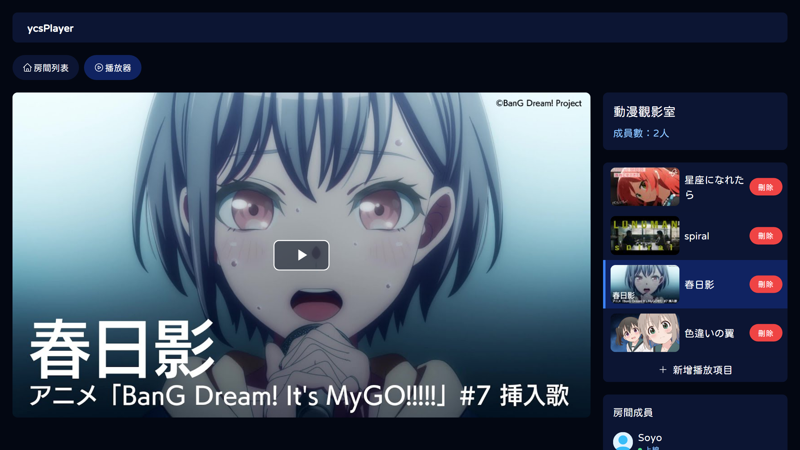

<br />
<h1 align="center">ycsPlayer</h1>
<p align="center">
<strong>
線上影音點播包廂<br>
像卡拉 OK 點歌機一樣選影片或點歌~🎵<br>
跟遠端的朋友們一起同步觀賞~✨
</strong>
</p>
<p align="center">

</p>
<br />

## 功能

* 房間成員可以**同步觀看和點播影片/聽音樂**
* 支援**播放 YouTube 影片**
* 支援**上傳影片/音樂**
* 支援**自動播放**功能
* 支援**播放完畢後自動刪除**功能
* 支援**正常帳密登入**和**無密碼登入**
* 房間管理員可以**邀請/請出成員**

起源是看到 LINE 有群組可以一起看 YT 的功能，但不能看其他網站的，而直播之類的又會 lag，想著想還是開始自幹一個XD

## 大綱

- [功能](#功能)
- [大綱](#大綱)
- [依賴](#依賴)
- [本地安裝](#本地安裝)
  - [Laravel Homestead 開發環境相關](#laravel-homestead-開發環境相關)
- [部署專案](#部署專案)
- [依賴軟體/服務](#依賴軟體服務)
  - [設定 Pusher](#設定-pusher)
  - [安裝 FFMpeg](#安裝-ffmpeg)
  - [DigitalOcean Spaces (S3 兼容儲存空間)](#digitalocean-spaces-s3-兼容儲存空間)
    - [上傳 Vite 資產到 DigitalOcean Spaces](#上傳-vite-資產到-digitalocean-spaces)
- [ycsPlayer 相關環境變數](#ycsplayer-相關環境變數)
  - [開放建立房間權限](#開放建立房間權限)
  - [播放器 Log 紀錄](#播放器-log-紀錄)
  - [無密碼登入](#無密碼登入)
- [專案 Artisan 指令](#專案-artisan-指令)
- [贊助](#贊助)
- [License](#license)

## 依賴

* PHP 8.1
* MySQL 8
* Node.js 18
* Yarn 1
* Mailgun (或是其他送信的 driver 都可以)
* Pusher
* FFMpeg
* DigitalOcean Spaces (S3 兼容儲存空間) - ***選擇性***

## 本地安裝

需要在 Linux 環境才能裝，我是用 Windows 跑在 Laravel Homestead 裡開發的。

基本的 PHP 8.1、MySQL 8 有了之後，就可以編輯 `.env` 檔：

```bash
cp .env.example .env
```

必須要設定的有 DB、Mail、Pusher，`YCSPLAYER` 開頭的變數可以參考 [ycsPlayer 相關環境變數](#ycsplayer-相關環境變數) 來設定。

broadcast driver 一定要設 `pusher`，關於 Pusher 可以[參考 設定 Pusher](#設定-pusher)。

還有轉影片的部分有依賴到 FFMpeg，要確保執行環境裡有存在 (執行 `ffmpeg -version` 確認)，要安裝可以參考[安裝 FFMpeg](#安裝-ffmpeg)。

然後執行指令來安裝依賴套件和編譯：

```bash
composer install
php artisan key:generate
php artisan migrate
php artisan db:seed
php artisan storage:link
yarn
yarn code-check
yarn build
```

裝完之後預設會是沒有用戶和房間，如果你想要馬上試用的話，可以執行指令來新增測試用戶和房間：

```bash
php artisan db:seed DummySeeder
```

然後就會有兩個用戶和房間，管理員的帳密是：

* E-mail：admin@example.com
* 密碼：password

普通用戶的帳密是：

* E-mail：soyo@example.com
* 密碼：password

如果想要讓上傳任務在背景執行，可以開啟 Redis 的 Queue，`QUEUE_CONNECTION` 要改成 `redis`。為了要讓 Queue 可以持續上傳約 1-2G 的大檔案，可以設定 30 分鐘 (1800秒) 的 timeout (Job 的最長執行時間)，但要記得每次改完程式碼後都必須重啟：

```bash
php artisan queue:work --timeout=1800
```

### Laravel Homestead 開發環境相關

啟動 Vite dev server 記得要轉發 Homestead 的 5173 port：

```bash
yarn dev
```

以及在 Homestead 裡要建立 Vite 開發伺服器的 HTTPS 證書的話，可以執行創建指令：

```bash
sudo /vagrant/scripts/create-certificate.sh localhost
sudo chmod -R 644 /etc/ssl/certs/localhost.key
```

然後在 `.env` 裡設定本地開發用證書路徑：

```
VITE_DEV_SERVER_KEY=/etc/ssl/certs/localhost.key
VITE_DEV_SERVER_CERT=/etc/ssl/certs/localhost.crt
```

## 部署專案

基本的 PHP 8.1、MySQL 8 有了之後，就可以編輯 `.env` 檔：

```bash
cp .env.example .env
```

必須要設定的有 DB、Mail、Pusher，如果有用 HTTPS 記得 `APP_URL` 網址要加上，`YCSPLAYER` 開頭的變數可以參考 [ycsPlayer 相關環境變數](#ycsplayer-相關環境變數) 來設定。

broadcast driver 一定要設 `pusher`，關於 Pusher 可以[參考 設定 Pusher](#設定-pusher)。

還有轉影片的部分有依賴到 FFMpeg，要確保執行環境裡有安裝過，要安裝可以參考[安裝 FFMpeg](#安裝-ffmpeg)。

然後執行指令來安裝依賴套件和編譯：

```bash
composer install --no-dev --no-interaction --prefer-dist --optimize-autoloader
php artisan key:generate
php artisan migrate --force
php artisan db:seed --force
php artisan storage:link
php artisan config:cache
php artisan route:cache
php artisan view:cache
yarn
yarn build
```

以上就是部署專案的流程，之後更新原始碼之後都要執行以下指令來更新專案：

```bash
composer install --no-dev --no-interaction --prefer-dist --optimize-autoloader
php artisan config:cache
php artisan route:cache
php artisan view:cache
php artisan migrate --force
php artisan queue:restart
yarn
yarn build
```

如果想要讓上傳任務在背景執行，可以開啟 Redis 的 Queue，`QUEUE_CONNECTION` 要改成 `redis`。為了要讓 Queue 可以持續上傳約 1-2G 的大檔案，可以在建立 Worker 時設定 30 分鐘 (1800秒) 的 timeout (Job 的最長執行時間)，但要記得每次更新完程式碼後都必須重啟。

如果覺得影片太慢常常 lag，可以試試 [在 DigitalOcean Spaces 儲存影片檔案](#digitalocean-spaces-s3-兼容儲存空間)，還有 CDN 加速來讓讀取速度變快。

## 依賴軟體/服務

### 設定 Pusher

專案中有使用到 Pusher 的 Channels 服務來及時同步房間的影片播放狀態，Pusher 有提供免費額度使用，基本上私人用量應該是不會到需要付費的程度。

註冊完帳號之後，到 [Pusher](https://pusher.com/) 新增 APP 後將 App keys 複製到 `.env`，只需要填 `PUSHER_APP_ID`、`PUSHER_APP_KEY`、`PUSHER_APP_SECRET`、`PUSHER_APP_CLUSTER` 這4個就可以：

```ini
PUSHER_APP_ID=[你的app_id]
PUSHER_APP_KEY=[你的key]
PUSHER_APP_SECRET=[你的secret]
PUSHER_HOST=
PUSHER_PORT=443
PUSHER_SCHEME=https
PUSHER_APP_CLUSTER=[你的cluster]
```

然後在 Pusher APP 的 Webhooks 設定裡加上兩個 `https://[your-domain]/pusher/webhook` 連結，**Event type** 選擇 *Channel existence* 和 *Presence*。如果在本地需要測試時，可以使用 ngrok 建立臨時網址來測試，但每次測試都需要更新網址到 Pusher 的後台。

### 安裝 FFMpeg

上傳檔案時有使用到 FFMpeg 來擷取影片縮圖，可以執行 `ffmpeg -version` 確認是否已安裝過，若需要安裝可以執行：

```
sudo apt install ffmpeg
```

### DigitalOcean Spaces (S3 兼容儲存空間)

DigitalOcean Spaces 是一個兼容 AWS S3 API 的服務，可以提供大容量的儲存空間，還有附加 CDN 加速功能，如果想要看影片更順暢的話可以使用此服務。不過這是要費用的，1 個月 5 美金起跳。

可以點下面連結來免費註冊 DigitalOcean，註冊完 2 個月內有 200 美金的免費額度可以玩：

[](https://www.digitalocean.com/?refcode=83488d5c9afd&utm_campaign=Referral_Invite&utm_medium=Referral_Program&utm_source=badge)

```ini
FILESYSTEM_DISK=do

DO_ACCESS_KEY_ID=[你的Key]
DO_SECRET_ACCESS_KEY=[你的Secret]
DO_DEFAULT_REGION=[你的region]
DO_BUCKET=[你的bucket]
DO_CDN_ENDPOINT=https://api.digitalocean.com/v2/cdn/endpoints/[你的CDN-ID]
DO_URL=https://[你的bucket].[你的region].cdn.digitaloceanspaces.com
DO_ENDPOINT=https://[你的region].digitaloceanspaces.com/
DO_USE_PATH_STYLE_ENDPOINT=false
```

> 配置方式是參考自 [Using Digital Ocean Spaces with Laravel](https://lightit.io/blog/using-digital-ocean-spaces-with-laravel-8/)。

`DO_BUCKET` 是開新的 Bucket 設定的名稱，`DO_DEFAULT_REGION` 是選擇的伺服器地區代號，`DO_ENDPOINT` 是 Endpoint 端點，記得開頭只有加地區代號，還有記得把 CDN 設定打開。

`DO_ACCESS_KEY_ID` 跟 `DO_SECRET_ACCESS_KEY` 到 [Spaces access keys](https://cloud.digitalocean.com/account/api/spaces) 新增，新增完一短一長的就是這兩個 KEY。

最後是 CDN 的設定，因為要在刪除完檔案之後順便也清掉 Cache 的檔案，需要設定清 CDN Cache 的 API 網址，網址取得方式為：

```bash
$ curl -X GET -H "Content-Type: application/json" \
    -H "Authorization: Bearer $API_TOKEN" \
    "https://api.digitalocean.com/v2/cdn/endpoints"
```

而 `API_TOKEN` 可以到 [Personal access tokens](https://cloud.digitalocean.com/account/api/tokens) 新增，取得完之後就可以刪掉了。在回傳的資料中可以看到 CDN Endpoint 的 ID，填到 `DO_CDN_ENDPOINT` 後面即可。因為使用了 CDN，就可以在 `DO_URL` 配置 CDN 專屬的網址了。

#### 上傳 Vite 資產到 DigitalOcean Spaces

使用到了 [@froxz/vite-plugin-s3](https://github.com/SergkeiM/vite-plugin-s3) 套件來上傳資產，當然預設是不會開啟上傳的。要使用之前需要先配置好上面 DigitalOcean Spaces 的金鑰等，然後把 `DO_UPLOAD_VITE_ASSETS_ENABLED` 設成 `true`，`ASSET_URL` 反註解掉：

```ini
DO_UPLOAD_VITE_ASSETS_ENABLED=true
ASSET_URL="${DO_URL}"
```

以及還要到 DigitalOcean Spaces 的 Settings 裡面設定 CORS，否則會因為跨域的原因無法執行 JS。在 CORS Configurations 裡面增加一條規則，`Allowed Methods` 允許 `GET`，`Access Control Max Age` 設定 5，然後儲存。

之後在每次執行 `yarn build` 的時候就會自動上傳到 DigitalOcean Spaces 了。

## ycsPlayer 相關環境變數

這些環境變數是 ycsPlayer 提供的一些功能的開關，可以自行斟酌是否要開啟。

### 開放建立房間權限

`YCSPLAYER_OPEN_ROOM_CREATION` 會決定是否要讓全部使用者都可以建立房間，開啟之後所有使用者不論是不是管理員都可以建立，而關閉之後就僅限管理員才能建立房間。

### 播放器 Log 紀錄

`YCSPLAYER_LOG_ENABLED` 會決定是否開啟播放器 Log 紀錄的功能，開啟之後在播放器的播放、暫停、拖曳進度條等操作時會記錄到 Log 中，用於排查錯誤時使用。

### 無密碼登入

`YCSPLAYER_PASSWORD_LESS` 會決定是否開啟「無密碼登入」的功能，開啟之後登入時不需輸入密碼，取而代之會以收 E-mail 來登入網站。

## 專案 Artisan 指令

| 功能                   | 指令                              | 說明                                                         |
| ---------------------- | --------------------------------- | ------------------------------------------------------------ |
| 新增管理員角色         | php artisan app:admin 1           | 讓 User ID 1 增加管理員角色。                                |
| 刪除管理員角色         | php artisan app:admin 1 --remove  | 刪除 User ID 1 管理員的管理員角色。                          |
| 同步房間權限資料       | php artisan room:sync-permissions | 如果有新增或刪除權限時，可以執行當前指令來同步。             |
| 清除過時的上傳暫存檔案 | php artisan room:queue-file:purge | 清除過時的上傳暫存檔案，設定 Schedule 之後會每天固定清一次。 |

## 贊助

如果我製作的專案有幫助到你，可以考慮[贊助我](https://www.patreon.com/ycs77)~ 我會很感謝你~ 而且還可以顯示您的大頭貼在我的主要專案中。

If you think my created projects have helped you, please consider [Becoming a sponsor](https://www.patreon.com/ycs77) to support my work~ and your avatar will be visible on my major projects.

<p align="center">
  <a href="https://www.patreon.com/ycs77">
    
  </a>
</p>

<a href="https://www.patreon.com/ycs77">
  
</a>

## License

[MIT LICENSE](LICENSE)
